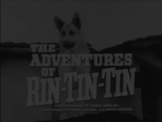
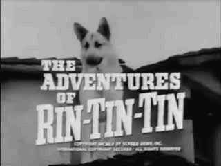
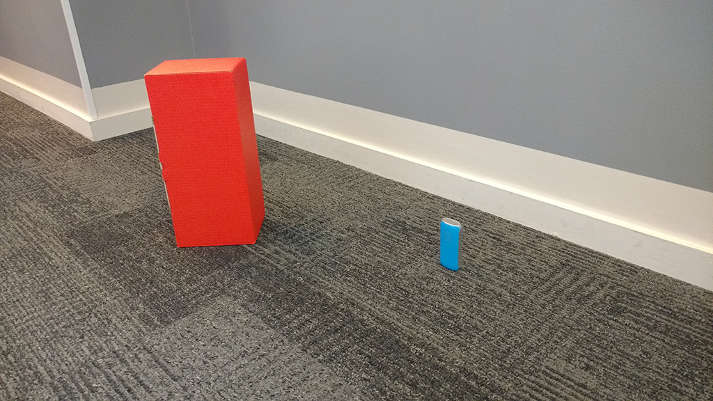
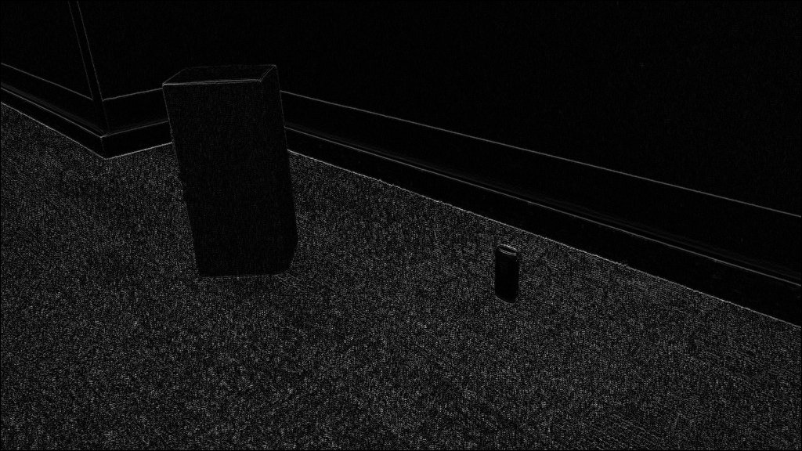
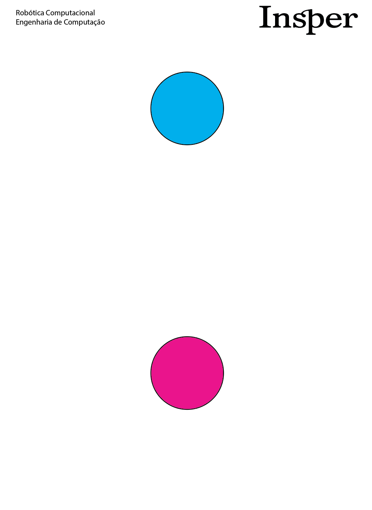
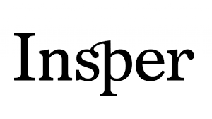

## Projects for learning image processing and ROS in Pyhton 3.7 with OpenCV 4 and ROSpy.

___
### Activity 1; Basic Image processing:

- ####   Part 1:
    - Brightness equalization
        Given the grayscale image: 
        
        
        
        One may notice that it is quite dark, that is because its pixel values are not using the full brightness range (0 to 255), how could one go about equalizing its brightness (make full use of the brightness interval)?

        My initial take on it, which was rather effective, was to simply linearly interpolate between the current max and min values and 0 and 255. Here's the result.
        
        

- ####   Part 2:
    - Edge detection
        How would one go about detecting borders on this image: 
        
        
        
        
        The suggested approach was to apply a kernel over every pixel of the image. Mainly, every pixel receives some linear combination of the surrounding pixels of the original image. If you were to apply the kernel in a way, such that every pixel receives the difference between the one on its right, and the one to its left, you would get brighter values on vertical edges due to the quick change of color most edges entail.
        Applying said kernel results in the following:
        
        

___
### Activity 2; Live image processing and shape recognition:

- ####  Introduction:
    In this activity, we could try and use OpenCV for some real-time object detection. For this, some techniques such as BRISK (for pattern recognition), CANNY edge detection, and Houghes circle detection algorithm were employed.
    Given the following piece of paper,
    
     
    
    how would one go about:
    
        1.  Reading a video-feed off of a webcam;
        2.  Identifying the circles on the feed, using cv2's inRange() function;
        3.  Assuming that the paper stays parallel to the camera, calculating its distance from it;
        4.  Drawing a line from the 2 circles in the feed, and the calculating the angle that line forms with the horizontal axis;
        5.  Using the BRISK detector to detect the word "INSPER" on the paper.
    
    - #### Part 1 & 2:
        Without much trouble, one might use the cv2.VideoCapture(0) function to use the integrated webcam (in my case from a laptop). Then one can use the cv2.inRange() function to create a binary mask from the captured frame, where the pixels within the range of selected colors is white, and the rest is black. Doing so for a certain color can be a little tricky, since lighting and print quality affect the results a lot, but still, after some fine tuning you can get some half-decent results (Note, the inRange() funtion only works with HSV images, so you have to use cv2.cvtColor() to transform them from RGB). Anyway, here's the combined mask I managed to make, for blue and magenta (colors on the paper):
        ")

    - #### Part 3 & 4:
        The next challenge is to get a good way to measure distance. The employed method involved essentially some basic proportionality trickery, but here's the gist of it; first we measure the distance between the circles in the paper, which comes out to about 14cm; then we mark out a known distance from the computer camera, such as 30cm. Once we know these, we can simply read the straight footage of the video, and apply the CANNY and Houghes algorithms to figure out where the circles are hiding. With the coordinates of their centers, we can do some basic euclidean distance for the pixel distance. With these two parts, we just start printing to the console, what the distance between the circles is while we loop through the real time footage. And, while holding the paper on the marked position (known to be 30cm away), we then can read the terminal to get a good estimate for the pixel distance at that fixed known distance. With these three numbers, we can determine a proper proportionality ratio, which will be called focus, from now on.

        With the focus of our camera in our hands, all we need is to reverse the maths we used to calculate the focus, to calculate the distance the paper is from the camera. And since we already got the centers for both circles, all we need to do is draw a line and calculate the arctangent of its slope (rise/run or dx/dy), to determine its angle (being careful not to divide by zero when vertical). With the, numbers done, all we need to do is draw them on the screen. 
        

    - #### Part 5:
        Finally, we must detect the text on the paper. I decided to identify it on the paper with a rectangle, but there are other ways of highlighting your matches. What I did here was fairly simple. The BRISK algorithm can detect keypoints in an image, and then with some maths we can compare those keypoints to see if they match up with some from our image.
        Here's the image I used to tell BRISK what to look for:

        

And here's how it turned out:
        

___
### Activity 3; Video processing for robot directioning in ROS environment (Gazebo):

In this project I collaborated with: [lucaskf1996](https://github.com/lucaskf1996) and [jpgianfaldoni](https://github.com/jpgianfaldoni).

- ####   Part 1: 
    - Vanishing point of a street-like video;

        First we were tasked with identifiying the vanishing point of the frames of a video in which there were two parallel lines, much like a normal runway. The idea was to see where the street was leading.

        The technique employed was to use a Hough Line transform on each frame, to then be able to intersect said lines, to find the vanishing point. That is, however, much more easier said than done. In the end, we applied a mask for white (much like the mask for magenta, and blue in the previous activity), and after selecting only lines with slopes that were not close to zero, were able to filter out most of the lines we didn't want. 

        Here's how it turned out:

        

- ####   Part 2 & 3:
    - Object detection with A.I.;
    
    We were then tasked with starting our study (however superficial) of Deep Learning and Neural Networks, for image analysis. First we started with YOLO (You Only Look Once), a powerhouse deep learning algorithm that can detect people, motorcycle, bananas, and some other whisical objects of day-to-day life. However, it was way too slow to be used on our laptops, and for that reason (mainly), we decided to use another algorithm.

    Enter MobileNet, a neural network that does the same thing as YOLO, athough not as accurately, and with less categories, but much faster. We downloaded a pre-trained model, since training these takes a notorious amount of computing power, and applied to our webcam to detect people. It would be able to detect many more types of objects, but we chose people because they're readily available. 

    Our final task was to make sure that our detection had happend for 5 (or, a certain fixed number) of frames in a row, before displaying the box around the object.

    Here's how it turned out:

    

- ####   Part 4:
    - Gazebo
    
    In order to simulate the TurtleBot that we're going to be using, we had to familiarize ourselves with the Gazebo toolset. Here's a video of it running.

    

- ####   Part 5 & 6:
    - Creating routines using ROSpy

    Now, we had to create some routines for our simulated robot. The first one has it roll forward a bit, then turn ninety degrees and repeat, allowing it to walk along the edges of a square. And the second one uses its on-board LYDAR to see the distance of what's in front of it, and then do it's best to oscilate around 1m away from whatever it see directly ahead.

    Here's some video of it working in the simulator:

    

    

